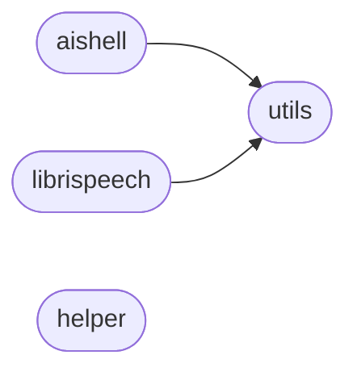

# Code Overview

[_Documentation generated by Documatic_](https://www.documatic.com)

<!---Documatic-section-Codebase Structure Python-start--->
## Codebase Structure Python

The codebase has a flat structure, with 4 code files.

<!---Documatic-block-system_architecture-start--->

<!---Documatic-block-system_architecture-end--->

# #
<!---Documatic-section-Codebase Structure Python-end--->

<!---Documatic-section-Important Functions-start--->
## Important Functions

<!---Documatic-block-important_funcs-start--->
<!---Documatic-block-most_used_funcs-start--->
### Most Utilised Functions

* [data.utils.create_manifest](3-data_utils.md#data.utils.create_manifest) (2 times)
<!---Documatic-block-most_used_funcs-end--->
<!---Documatic-block-important_funcs-end--->

# #
<!---Documatic-section-Important Functions-end--->

<!---Documatic-section-File IO-start--->
## File IO

<!---Documatic-block-file_io-start--->
The following files have file read operations

<!---Documatic-block-data-start--->

	
<code>data</code> (Click to Expand!)

* data.aishell
* data.helper
* data.librispeech
* data.utils

<!---Documatic-block-data-end--->

The following files have file write operations

<!---Documatic-block-data-start--->

	
<code>data</code> (Click to Expand!)

* data.aishell: labels/aishell_labels.json, labels/aishell_lang_labels.json, manifests/aishell_dev_lang_manifest.csv, manifests/aishell_dev_manifest.csv, manifests/aishell_test_lang_manifest.csv, manifests/aishell_test_manifest.csv, manifests/aishell_train_lang_manifest.csv, manifests/aishell_train_manifest.csv
* data.helper
* data.librispeech
* data.utils

<!---Documatic-block-data-end--->
<!---Documatic-block-file_io-end--->

# #
<!---Documatic-section-File IO-end--->

[_Documentation generated by Documatic_](https://www.documatic.com)